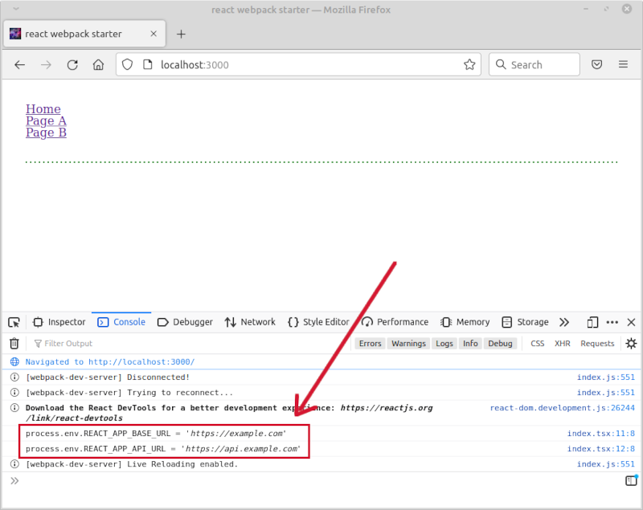

# react-webpack-starter

Un opinionated React + Webpack starter.

## Rationale

Using the following versions of NPM packages:

- dependencies
  - [react](https://www.npmjs.com/package/react) v17.0.2
  - [react-dom](https://www.npmjs.com/package/react-dom) v17.0.2
  - [react-router-dom](https://www.npmjs.com/package/react-router-dom) v6.3.0
  - [redux](https://www.npmjs.com/package/redux) v4.2.0
  - [react-redux](https://www.npmjs.com/package/react-redux) v8.0.1
- devDependencies
  - [sass](https://www.npmjs.com/package/sass) v1.51.0
  - [webpack](https://www.npmjs.com/package/webpack) v5.72.0
  - [typescript](https://www.npmjs.com/package/typescript) v4.6.3
  - [@babel/core](https://www.npmjs.com/package/@babel/core) v7.17.9
  - a few others; see [package.json](./package.json)

we aim to boostrap a complete React development environment for coding in TypeScript. We want an option to create a build for production deployments, along with an option to quickly start a development server. The project uses [dart-sass](https://github.com/sass/dart-sass) for styling; `dart-sass` is compiled to JavaScript as a NPM package (see [sass](https://www.npmjs.com/package/sass)).

A strict requirement for this project is to keep the build as small as possible. Therefore, unneeded Node.js and NPM packages are not included in the resulting build. One should include **only necessary** Node.js back-end code in front-end apps (and do so with caution)!

## Pre-requisites

You need at least Node.js v14.x available. See [instructions](https://nodejs.org/en/download/) on how to set up Node.js locally.

## Installing

First clone this repo somewhere:

```shell
git clone https://github.com/valera-rozuvan/react-webpack-starter.git
```

Switch to repo folder, and install dependencies:

```shell
cd /home/user/path/to/react-webpack-starter
npm install
```

## Running

Several NPM commands are included for running, building, and doing other maintenance tasks. 

### Local development

Launch a dev server with auto reloading, and source maps for debugging:

```shell
npm run start
```

You can now open [localhost:3000](http://localhost:3000/) in your browser, and observe the live application.

If you want to change the default port `3000`, add the line:

```text
PORT=8001
```

to the end of `.env` file. Replace `8001` with the desired port number.

### Generating a build for debugging 

Create a build for debugging purposes (source maps will be included, NO live reload):

```shell
npm run build:local
```

This will generate a `build` folder, which is suitable to be used with a 3rd party static file server. Use for testing purposes only!

### Production build

Create a minified production build (NO source maps, NO live reload):

```shell
npm run build
```

This will generate a `build` folder. Use any static file server to host your production front-end app.

### Linting

This project uses [ESLint](https://eslint.org/) to enforce code style and catch simple syntax errors while coding. The following NPM commands are provided:

```shell
npm run lint # checks all files using settings from `.eslintrc.js` config
npm run lint:fix # To automatically fix some errors.
```

**NOTE 1**: Author's preference is to use airbnb coding style. You can change that in [.eslintrc.js](.eslintrc.js) file.

**NOTE 2**: Some files/directories are excluded when linting. See [.eslintignore](.eslintignore) file.

## dotenv

Out of the box, this project supports a `.env` configuration file. Environment variables from this file are sourced using [dotenv](https://www.npmjs.com/package/dotenv) NPM package. This happens when Webpack is performing a build. Variable names which have a prefix `REACT_APP_` will be available at runtime in the React app via the global object `process.env`. When you run this project, you can open the browser's JavaScript console, and observe the following:

```text
process.env.REACT_APP_BASE_URL = 'https://example.com'
process.env.REACT_APP_API_URL = 'https://api.example.com'
```



The above variables are defined in the [.env](./.env) file.

NOTE: The `dotenv` NPM package is used only at build time. It is not included in the resulting build.

## Minimal size

Out of the box, when building this repo for production, you will get 5 files in the `build` folder:

```text
$ ls -ahl ./build

total 208K
4,0K  .
 16K  favicon.ico
 376  index.html
174K  main.js
2,3K  main.js.LICENSE.txt
1,1K  reset.css
```

The total size of the folder is 168K:

```text
$ du -h ./build

208K	./build
```

## License

Licensed under MIT. See [LICENSE](LICENSE) for more details.
